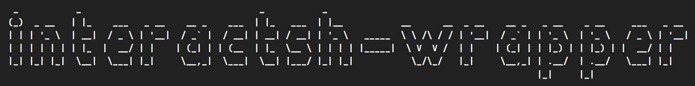

# interactsh-wrapper



**interactsh-wrapper** is a Node.js server that interacts with the `interactsh-client` to fetch and filter interactions.

## Getting Started

### Prerequisites

-   Make sure you have Go installed and added to the PATH. If not, follow these steps:

    -   Download the Go binary distribution for your operating system and architecture from the official Go website: [https://golang.org/dl/](https://golang.org/dl/)

-   Extract the downloaded archive. For example, if you downloaded `go<VERSION>.<OS>-<ARCH>.tar.gz`, run the following command:

    ```bash
    sudo tar -C /usr/local -xzf go<VERSION>.<OS>-<ARCH>.tar.gz
    ```

-   Add the Go binary directory to the PATH environment variable. You can do this by adding the following line to your shell profile file (e.g., `~/.bashrc`, `~/.bash_profile`, `~/.zshrc`):

    ```bash
    export PATH=$PATH:/usr/local/go/bin
    ```

    -   Save the file and reload the shell profile or restart your terminal.

-   Make sure you have the `interactsh-client` installed. You can install it by running the following command:

    ```bash
    go install -v github.com/projectdiscovery/interactsh/cmd/interactsh-client@latest
    ```

### Installation

#### Docker

To use the Docker image, follow these steps:

1. Pull the image:

    ```bash
    docker pull hbarsaiyan/interactsh-wrapper:v1
    ```

2. Run a Docker container:

    ```bash
    docker run -p 8000:8000 hbarsaiyan/interactsh-wrapper:v1
    ```

#### Manual Installation

To manually install the interactsh-wrapper, follow these steps:

1. Clone this repository:

    ```bash
    git clone https://github.com/your-username/interactsh-wrapper.git
    ```

2. Install dependencies:

    ```bash
    npm install
    ```

3. Run the server:

    ```bash
    npm start
    ```

## Usage

### API Endpoints

### 1. Get OOB testing payload

-   **Endpoint**: `/api/getURL`
-   **Method**: GET
-   **Description**: Retrieves the current interactsh URL used by the `interactsh-client`.
-   **Example Response**:

    ```json
    {
        "url": "https://cmr9e6j1ntfgnq5da8kgkx5ky4ywxksp4.oast.live"
    }
    ```

### 2. Get Interactions with payload

-   **Endpoint**: `/api/getInteractions`
-   **Method**: POST
-   **Description**: Retrieves interactions with the OOB payload based on the start timestamp and end timestamp as the request body in JSON format.
-   **Example Response**:

    ```
    [
        {
        "payload": "https://cnd1nsekah78hvd9iii0hfsr7df9d4j7q.oast.online",
        "callerIp": "117.250.161.194",
        "timestamp": "2024-02-24 16:40:29"
        },
        {
        "payload": "https://cnd1nsekah78hvd9iii0hfsr7df9d4j7q.oast.online",
        "callerIp": "117.250.161.194",
        "timestamp": "2024-02-24 16:40:31"
        },
        {
        "payload": "https://cnd28vekah7bv05tultgonnk5krtc5d8s.oast.pro",
        "callerIp": "117.250.161.194",
        "timestamp": "2024-02-24 17:17:02"
        },
        {
        "payload": "https://cnd28vekah7bv05tultgonnk5krtc5d8s.oast.pro",
        "callerIp": "117.250.161.194",
        "timestamp": "2024-02-24 17:17:03"
        }
    ]
    ```

## License

The code in this repository is licensed under the [GNU Affero General Public License v3.0 (AGPL-3.0)](https://www.gnu.org/licenses/agpl-3.0.en.html).
